

  

# Touch & Go

> A biometric attendance tracking system using fingerprint scanning — built for university classrooms on a Raspberry Pi.

> [!NOTE]
> **This project is no longer live.** Touch & Go was a university capstone project completed in Fall 2023 for CSC 355. The production site (`touchandgo.software`) and AWS staging environment are no longer running. This repository is preserved as a portfolio and academic archive.

---

## Table of Contents

- [Overview](#overview)
- [Screenshots](#screenshots)
- [System Architecture](#system-architecture)
- [Tech Stack](#tech-stack)
- [Features](#features)
- [Use Cases & Actors](#use-cases--actors)
- [Fingerprint Scan Flow](#fingerprint-scan-flow)
- [Requirements UML Diagrams](#requirements-uml-diagrams)
- [Database Design](#database-design)
- [Sequence Diagrams](#sequence-diagrams)
- [Non-Functional Requirements](#non-functional-requirements)
- [Testing](#testing)
- [Known Limitations](#known-limitations)
- [Project Documentation](#project-documentation)
- [Team](#team)

---

## Overview

Touch & Go replaces paper sign-in sheets and manual roll calls with a fingerprint scanner mounted in the classroom. Students scan their finger to mark attendance, professors receive attendance reports through a web portal, and admin staff manage enrollments and system health.

The system runs a Python application on a Raspberry Pi 3 Model B connected to an R307 Optical Fingerprint Scanner and LCD display. A WireGuard VPN tunnel connects the Pi to an AWS EC2 instance hosting an Apache web server and MariaDB database.

**Major features:**
- Raspberry Pi handles all computing between the fingerprint scanner, LCD display, web server, and database
- R307 fingerprint scanner confirms every student's identity
- LCD display outputs feedback after each scan — success or error
- Web portal for students and professors to view attendance data, schedules, and contact information
- Admin portal for managing users, courses, and fingerprint enrollment

---

## Screenshots

Screenshots below are from static demo pages that recreate the student-facing web portal with representative data. The original site was server-rendered PHP connected to a live MariaDB database and is no longer running.

> The admin panel (user management, course management) was built entirely in PHP and was not preserved as static HTML. It is documented in the [SRS](https://drive.google.com/drive/folders/1u4nIICvpnq-juQDpWkTJimE453x217N9) and sequence diagrams in [`docs/diagrams/`](docs/diagrams/).

| Login | Home |
|---|---|
| 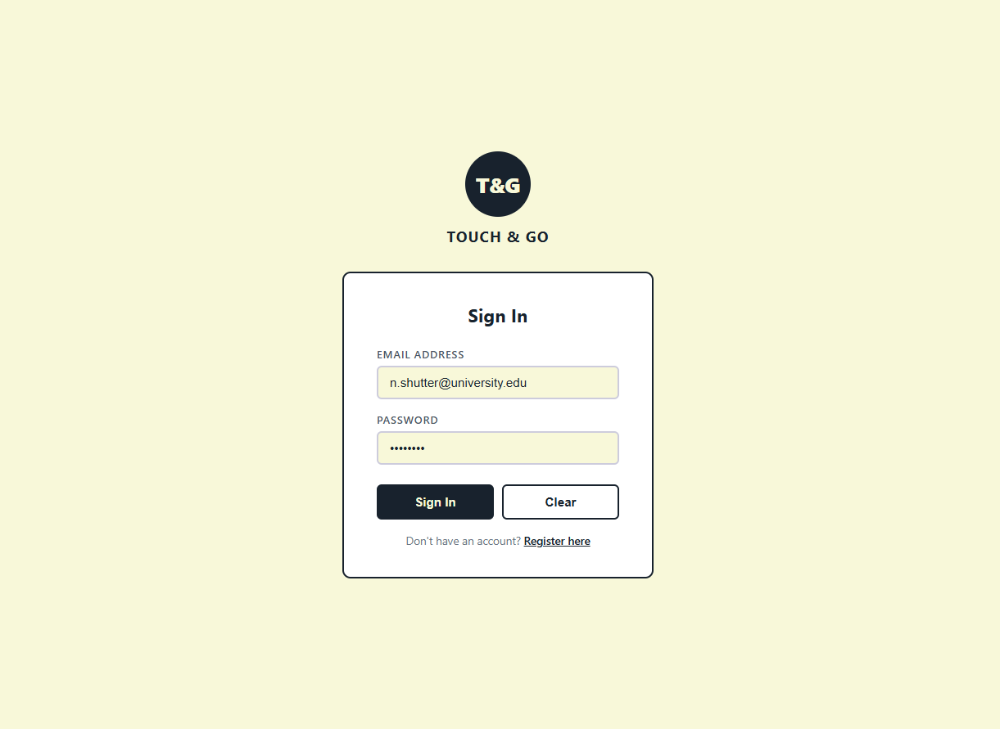 | 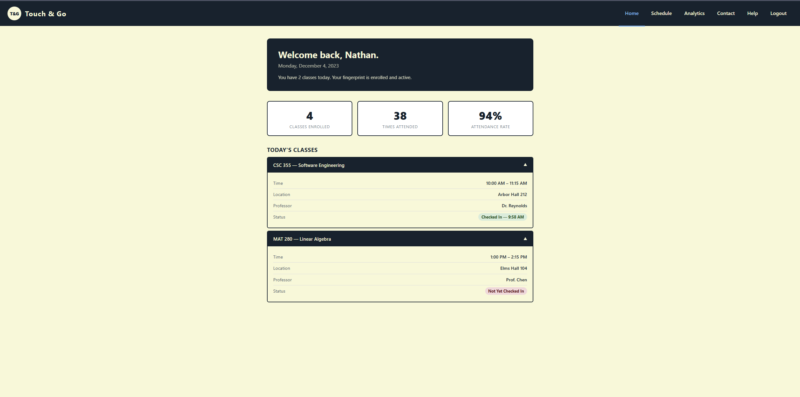 |

| Analytics | Schedule |
|---|---|
| 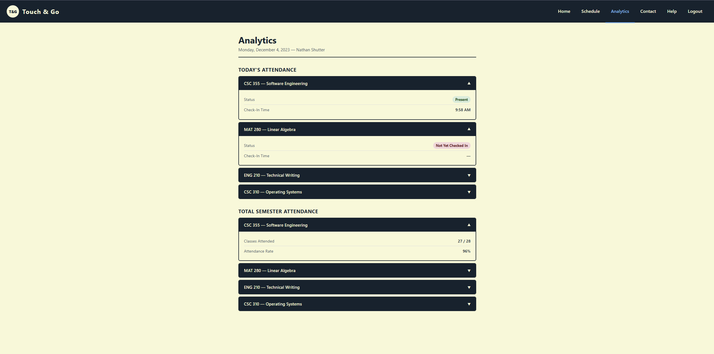 | 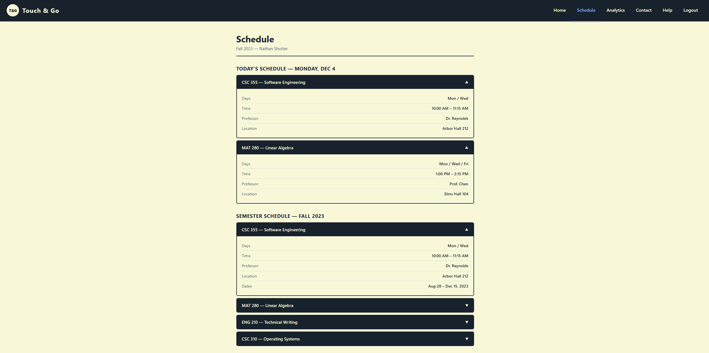 |

| Contact | Help |
|---|---|
| 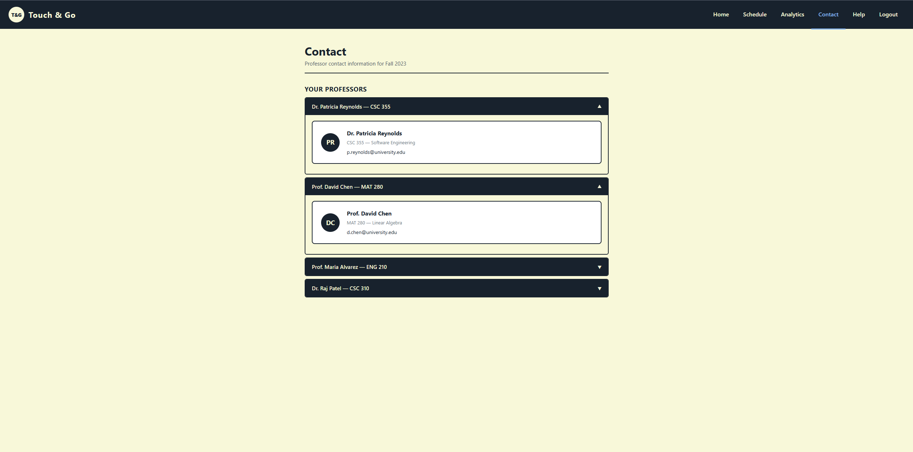 | 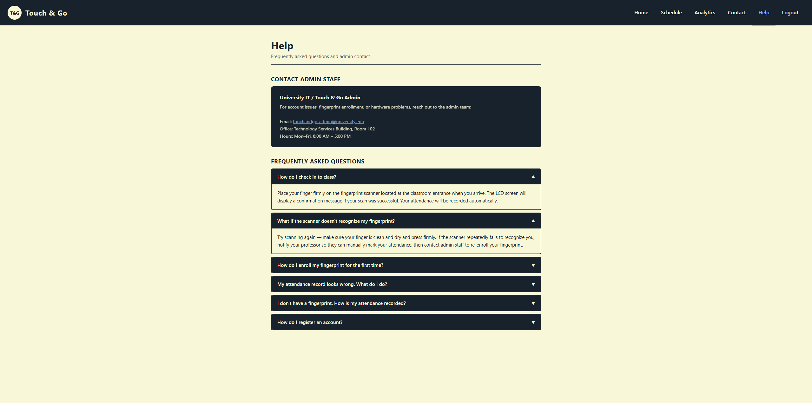 |

---

## System Architecture

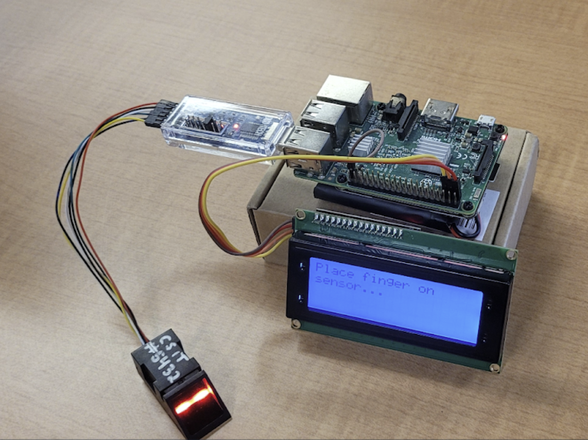

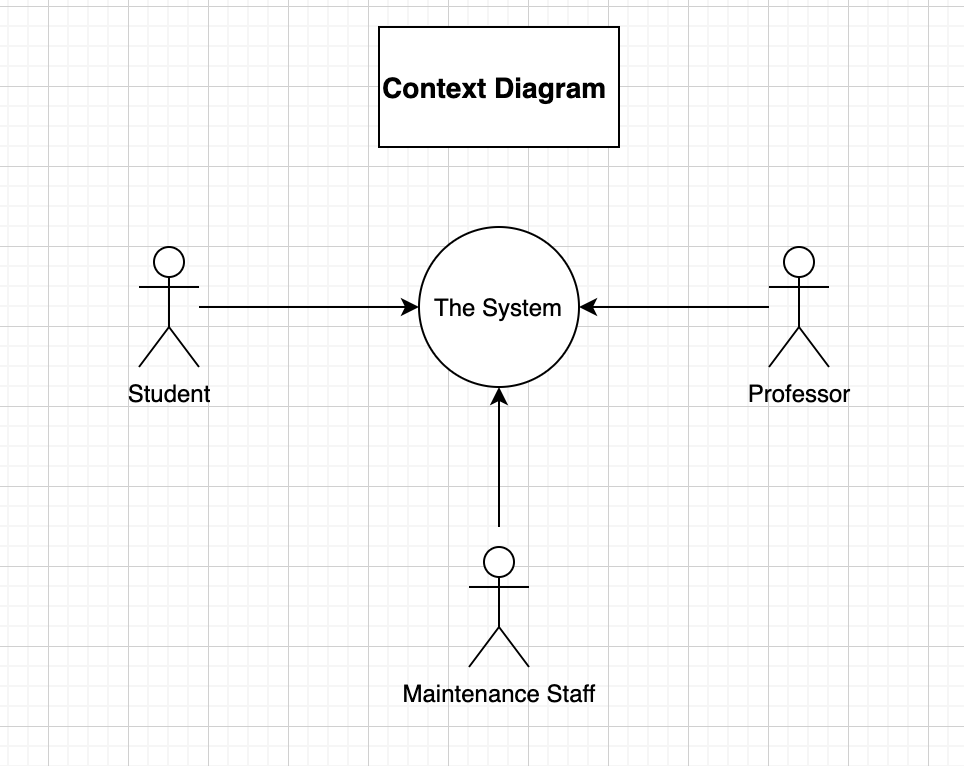

**Architecture components:**

**R307 Optical Fingerprint Scanner** — reads fingerprints and passes scan data to the Raspberry Pi via API calls. Stores authenticated user templates used for matching.

**Raspberry Pi 3 Model B** — the central computing device. Interfaces with the scanner and LCD, handles fingerprint matching, and records attendance to the database over the VPN.

**LCD Screen** — provides real-time feedback to students after each scan, confirming successful check-in or displaying an error.

**WireGuard VPN** — sits between the Raspberry Pi and the AWS EC2 instance, providing a secure tunnel for all database communication.

**MariaDB Database** — hosted on the EC2 instance. Stores all data for students, professors, courses, and attendance records.

**Apache Web Server** — hosted on the EC2 instance. Serves the student/professor portal and admin panel.

**AWS EC2 Instance** — cloud server hosting both the database and web server.

---

## Tech Stack

| Layer | Technology |
|---|---|
| Hardware | Raspberry Pi 3 Model B, R307 Optical Fingerprint Scanner, I2C LCD Display |
| Scanner App | Python |
| Web Backend | PHP |
| Database | MariaDB |
| Web Server | Apache |
| Hosting | AWS EC2 |
| Networking | WireGuard VPN |
| Diagramming | draw.io |

---

## Features

### Hardware
- **Enroll Fingerprint** — Admin runs an enrollment script with a student present. Student scans their finger twice to register their template in the system.
- **Scan Finger** — Student places finger on scanner at class time. Pi authenticates against stored templates and records attendance.
- **Receive Feedback** — LCD displays a success or error message immediately after each scan.

### Web Portal (Student & Professor)
- **Register Account / Login / Logout** — Standard authenticated access; separate flows for students, professors, and admins.
- **View Home Page** — Personalized greeting and current date.
- **View Schedule Page** — Daily and semester class schedule with days, times, professor, and location.
- **View Help Page** — FAQ section and admin contact information.

### Student
- **View Attendance** — Today's attendance status and check-in time per class; total semester attendance count per class.
- **View Professor Contact Information** — Email addresses for all enrolled professors.

### Professor
- **View Student Attendance** — Check-in date and time for every student across all classes for the semester.
- **View Student Contact Information** — Name and email for every enrolled student per class.

### Admin
- **Search User Account** — Search all users by name or email; filter by student, professor, or admin type.
- **Edit / Delete User Account** — Update user fields or remove a user from the system.
- **Add User Account** — Create student, professor, or admin accounts (the only way to create admin accounts).
- **Create Course** — Add a new course with prefix, name, description, location, schedule, and dates.
- **Edit Course** — Search and update any course field.
- **Edit Student Course Relationship** — Add or remove courses a student is enrolled in.
- **Edit Professor Course Relationship** — Add or remove courses a professor is teaching.

---

## Use Cases & Actors

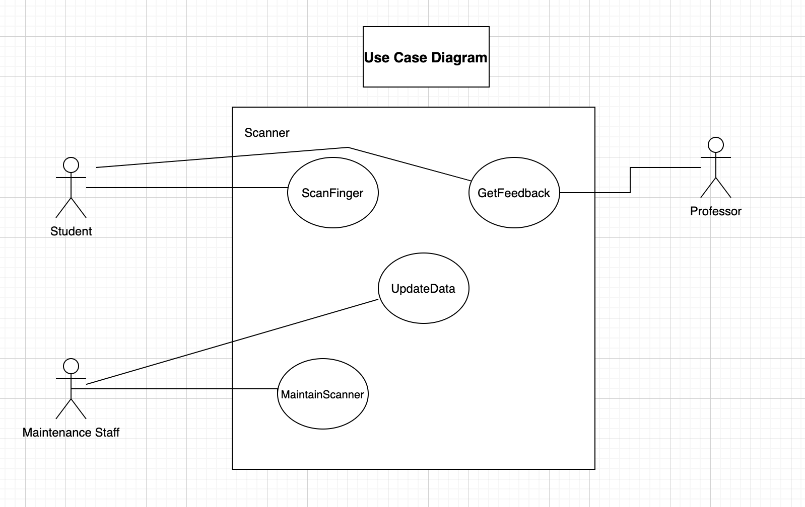

**Student** — attends a college or university using Touch & Go, enrolled in in-person courses on a regular schedule.

**Professor** — proctors a class at an institution using Touch & Go.

**Admin** — system administrator responsible for enrolling users, managing data, and ensuring hardware and software are functioning.

---

## Fingerprint Scan Flow

Two approaches were designed. Idea 2 (template-based matching) was implemented, giving finer control by storing raw binary data and building templates in-house.

### Idea 1 — API-Based Matching

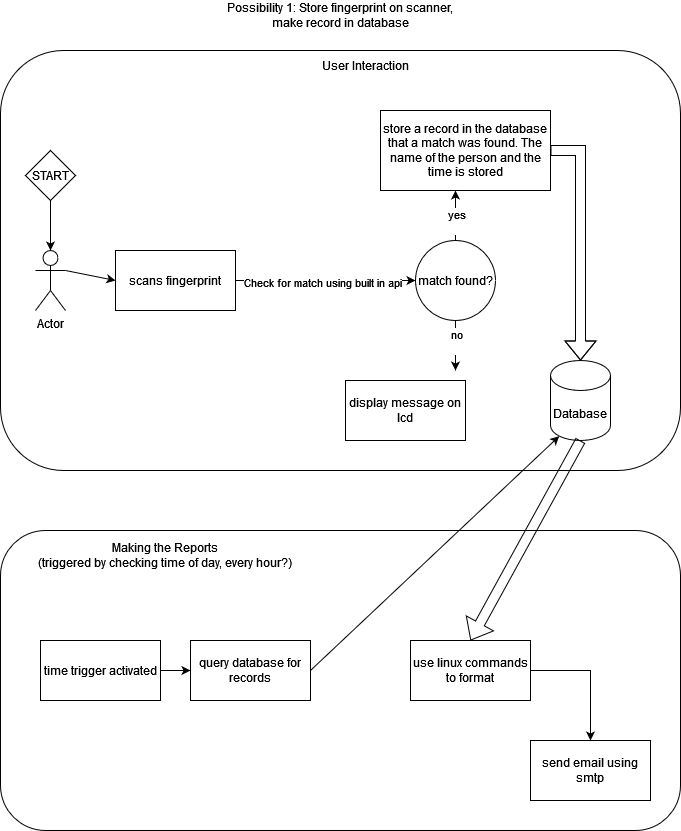

The scanner's built-in API handles matching. On a hit, a record is written to the database with the student name and timestamp. A time-triggered cron job queries records and emails the report via SMTP.

### Idea 2 — Template-Based Matching (Implemented)

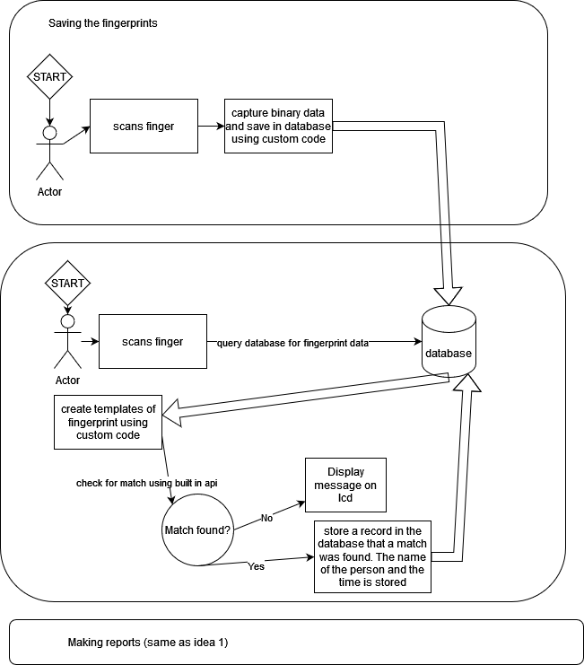

Raw fingerprint binary is captured and stored in the database. Custom code builds templates from stored data, then uses the scanner API to compare against a live scan. On a match, attendance is recorded and the LCD displays a confirmation.

---

## Requirements UML Diagrams

### Scan Finger

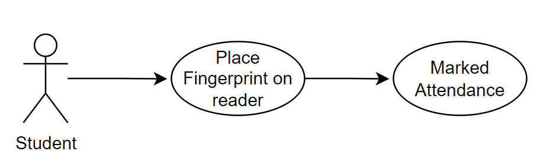

### Maintain Scanner

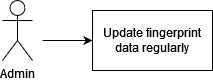

### Other Systems

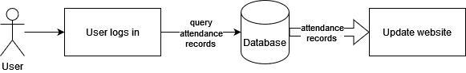

### Security

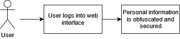

### Performance

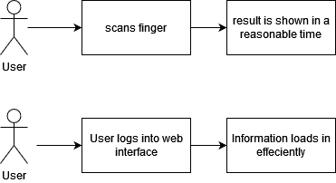

> Draw.io source files for all requirements UML diagrams are in [`docs/diagrams/`](docs/diagrams/).

---

## Database Design

The database tracks students, professors, courses, fingerprint templates, and attendance records.

> Draw.io source: [`docs/diagrams/DatabaseSchema.drawio`](docs/diagrams/DatabaseSchema.drawio)

| Entity | Key Fields |
|---|---|
| Student | `student_id`, `first_name`, `last_name`, `email`, `password`, `fingerprint (BLOB)` |
| Professor | `professor_id`, `first_name`, `last_name`, `email`, `password`, `phone_number` |
| Course | `course_id`, `course_prefix`, `course_name`, `description`, `location`, `start_date`, `end_date`, `days`, `start_time`, `end_time` |
| Attendance | `record_id`, `student_id (FK)`, `course_id (FK)`, `timestamp` |
| Admin | `admin_id`, `first_name`, `last_name`, `email`, `password` |

---

## Sequence Diagrams

Draw.io source files for all sequence diagrams are in [`docs/diagrams/`](docs/diagrams/). Open with [draw.io](https://app.diagrams.net/) or the VS Code Draw.io extension.

| Diagram | File |
|---|---|
| Login | `LoginSequenceDiagram.drawio` |
| Register Account | `NewRegisterAccountSequenceDiagram.drawio` |
| Complete Scan Flow | `CompleteSequenceDiagram.drawio` |
| Add User | `addUser.drawio` |
| Edit User | `editUser.drawio` |
| Search User | `searchUser.drawio` |
| Create Course | `createCourse.drawio` |
| Edit Course | `editCourse.drawio` |
| Professor Course View | `professorCourse.drawio` |
| Student Course View | `studentCourse.drawio` |
| View Student Contact Info | `viewStudentContactInformation.drawio` |

---

## Non-Functional Requirements

### Security
- SSL certificate obtained for `touchandgo.software`
- EC2 instance security groups configured
- WireGuard VPN connecting the Raspberry Pi to the EC2 instance
- Password hashing on all user accounts

### Performance
- Target uptime: 99.95% on the AWS EC2 instance
- Fingerprint authentication target: under 500 milliseconds
- Attendance recording target: under 2 seconds

### Maintainability
- Fingerprint data updated on a semester basis and when student enrollment changes
- Scanner periodically tested for effectiveness and accuracy
- EC2 instance snapshot scheduling for disaster recovery and business continuity

---

## Testing

Testing was conducted manually against defined test cases in Sprint 6.

| Test Case | Result |
|---|---|
| Scan Finger | Passed |
| Get Feedback | Passed |
| Update Data | Passed |
| Maintain Scanner | Passed |
| Login | Passed |
| Logout | Passed |
| Other Systems | Passed |
| Maintainability | Passed |
| Filter Results | Untested |
| Security | Untested |
| Performance | Untested |
| Housing | Untested |

Automated testing was explored but not implemented within the project timeline.

---

## Known Limitations

The following items were identified but not completed before the project concluded:

- Scheduling interface for students to book fingerprint enrollment appointments with admin staff
- 3D printed hardware housing for the Raspberry Pi and scanner
- Performance testing
- Ability for students to filter their own fingerprint records

---

## Project Documentation

Full documentation archive is in [`docs/diagrams/`](docs/diagrams/) and the original project files are on [Google Drive](https://drive.google.com/drive/folders/1u4nIICvpnq-juQDpWkTJimE453x217N9).

| Document | Description |
|---|---|
| Software Requirements Specification | Full functional and non-functional requirements (v1.4) |
| Detailed Design Document | System-level design decisions |
| UML Diagrams | Context, use case, and requirements diagrams |
| Sequence Diagrams | All user flows and interactions |
| Requirements Traceability Matrix | Requirements mapped to test cases |
| Sprint 6 Presentation | Final demo deck |

---

## Team

Developed as a software engineering capstone for CSC 355, Fall 2023.

| Name | Role |
|---|---|
| Nathan Shutter | Developer |
| Joseph Webber | Developer |
| Christopher Clark | Developer |
